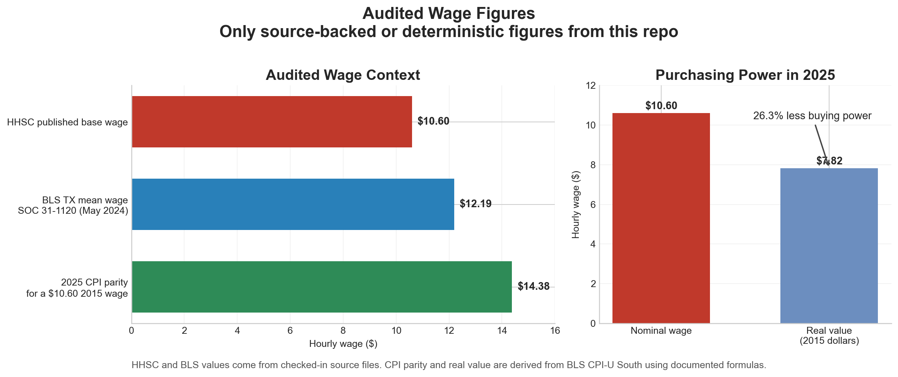

# Texas HHCS — ICF/IID & HCS Provider Economics Investigation

**How Texas's $10.60 Wage Assumption Shows Up in Public Rate Data**

More than 314,000 home health and personal care aides work in Texas. The state agency that sets their Medicaid reimbursement rates — the Health and Human Services Commission (HHSC) — publishes a **$10.60 an hour** base target wage in its Personal Attendant Base Wage Calculator. Adjusted for inflation, that figure buys **$7.82 in 2015 dollars**. When a commenter asked HHSC to use independent federal labor market data instead of provider self-reported cost reports, the agency declined — locking in a wage methodology that references only its own outputs.

Every figure in this README is either read directly from a checked-in source file or derived deterministically from those files with documented formulas. See [METHODOLOGY.md](METHODOLOGY.md) and [VERIFICATION.md](VERIFICATION.md) for the full audit trail.

---



*Only audited figures are shown here: the HHSC base wage from the checked-in calculator, the May 2024 Texas BLS mean for SOC 31-1120, and the CPI-derived purchasing-power adjustment documented in this repo.*

---

## What We Found

| What | Number | Type | Where it comes from |
|---|---|---|---|
| HHSC base target wage in calculator | **$10.60/hr** | Source | HHSC wage calculator, cell B7 (updated 2/7/2025) |
| What $10.60 actually buys in 2025 | **$7.82/hr** | Derived | Adjusted to 2015 dollars using BLS CPI-U South |
| What $10.60 should be in 2025 dollars | **$14.38/hr** | Derived | Same CPI data, calculated forward |
| Average pay for TX home health and personal care aides | **$12.19/hr** | Source | Bureau of Labor Statistics, OEWS May 2024, SOC 31-1120 |
| Number of TX home health and personal care aides | **314,610** | Source | Bureau of Labor Statistics, OEWS May 2024, SOC 31-1120 |
| HHSC rejected BLS data for wage methodology | Declined to use independent labor market data; chose provider self-reported cost reports instead | Source | [Texas Register, Sept 5, 2025, §355.7052 adoption](https://www.sos.state.tx.us/texreg/archive/September52025/Adopted%20Rules/1.ADMINISTRATION.html) |
| Legislature set $13.00/hr attendant wage assumption | GAA Rider 23 funds the new rate; SB 457 adds nursing facility patient care expense ratio | Source | [SB 1 Rider 23](https://capitol.texas.gov/BillLookup/History.aspx?LegSess=89R&Bill=SB1), [SB 457](https://capitol.texas.gov/BillLookup/History.aspx?LegSess=89R&Bill=SB457), 89th Legislature |

*Type key: **Source** = read directly from a checked-in source file. **Derived** = calculated from source data using a documented formula. See [METHODOLOGY.md](METHODOLOGY.md) and [VERIFICATION.md](VERIFICATION.md) for the audit trail.*

The official BLS occupation title for SOC `31-1120` is **Home Health and Personal Care Aides**, which is broader than Medicaid-funded waiver staff alone.

No waitlist-clearing timeline, turnover, retail-wage, or replacement-cost scenario is treated as an audited headline figure in this README.

## New Verified Datasets

The repo now includes source-audited datasets built directly from official HHSC files.

| Dataset | What it contains | Example verified value |
|---|---|---|
| `data/processed/hhsc_interest_list_totals_monthly.csv` | Monthly interest-list totals by program from the HHSC workbook archive | **HCS = 130,764** and **TxHmL = 117,175** as of **January 31, 2026** |
| `data/processed/hhsc_interest_list_releases_summary_monthly.csv` | Monthly release, enrollment, pipeline, and current-count summary metrics | **HCS enrolled = 339** and **HCS total releases this biennium = 284** in the January 2026 workbook |
| `data/processed/hhsc_interest_list_legislative_allocations.csv` | The official allocation table posted by HHSC for the 2022-23 biennium | **HCS = 542 slots**, **TxHmL = 471**, **Total = 1,549** |
| `data/processed/hhsc_setting_costs_fy2023.csv` | HHSC monthly average Medicaid cost per individual by setting | **Community ICF/IID = $5,247.52**, **HCS residential = $6,563.91** |
| `data/processed/hhsc_community_icf_iid_costs_by_lonsize_fy2023.csv` | Community ICF/IID monthly cost and average individuals served by level of need and facility size | **LON 1 / Small = 999 people served, $4,232.10 per person-month** |
| `data/processed/hhsc_residential_rate_components.csv` | HHSC reimbursement components for HCS `SL/RSS` and non-state community ICF/IID residential rates | **ICF small LON 1 attendant component = $60.3944**; **HCS supervised living LON 5 attendant component = $85.74** |
| `data/processed/hhsc_cost_report_cost_areas.csv` | Verified HCS/ICF cost-report categories from the official 2024 instructions | HCS includes `RESIDENTIAL_SL_RSS`; ICF includes `RESIDENTIAL_SMALL_MEDIUM_LARGE` and `DAY_HABILITATION` |

## What the Audited Evidence Supports

Taken together, the audited evidence tells a consistent story: **the wage assumption that anchors Medicaid reimbursement for Texas's largest direct care workforce has not kept pace with inflation, trails the BLS market mean, and is set by a methodology that was explicitly offered an independent alternative and declined it.**

- HHSC's published calculator still starts from **$10.60/hr**
- CPI parity from a 2015 base year is about **$14.38/hr**
- The May 2024 BLS Texas mean for SOC 31-1120 is **$12.19/hr**
- Even after Rider 23's increase to **$13.00/hr**, the new wage remains **$1.38/hr below** CPI parity
- Texas has the **largest HHA/PCA wage gap nationally** at **$6.77/hr** below the entry-level benchmark (ASPE Dec 2024)
- HHSC's latest checked-in interest-list workbook reports **130,764 HCS** names and **117,175 TxHmL** names as of **January 31, 2026**
- HHSC's audited FY 2023 cost comparison report shows **$5,247.52** per month for **community ICF/IID** and **$6,563.91** for **HCS residential**

The repo contains source-audited waitlist counts, release tables, legislative allocation data, HCS/ICF cost tables, national wage comparisons, and rate enhancement effectiveness data. It does not contain a reproducible waitlist-clearing timeline, a provider profit-and-loss model, or a Texas-specific turnover estimate — those remain out of scope until underlying data and assumptions are checked in and tested.

---

## How This Analysis Works

<details>
<summary><strong>Where the data comes from</strong></summary>

The audited material in this README uses five source families.

| Source | What we pulled | Website |
|---|---|---|
| **HHSC** (Texas Health & Human Services) | The $10.60 wage target and per-service rate inputs | pfd.hhs.texas.gov |
| **HHSC** interest-list reporting | Monthly workbook snapshots of waiver interest-list totals and releases | hhs.texas.gov |
| **HHSC** cost comparison and cost-report instructions | Per-person cost tables and operator cost-area definitions for HCS and ICF/IID | hhs.texas.gov |
| **BLS** (Bureau of Labor Statistics) | How many home health and personal care aides work in Texas, and what they earn | bls.gov/oes/ |
| **BLS** Consumer Price Index | Inflation data for the South region | bls.gov/cpi/ |
| **LBB** (Legislative Budget Board) | Cross-checks on rider language and earlier misapplied slot claims | lbb.texas.gov |

Supplementary audit files from LBB and NCI are still kept locally to verify that earlier waitlist and turnover claims were overstated or misapplied. The new waitlist and operator-cost datasets, however, are now built from official HHSC files that are checked into `data/raw/official/`.

</details>

<details>
<summary><strong>How we did the math</strong></summary>

- **Inflation adjustment:** We used the Consumer Price Index for the South to calculate what $10.60 from the repo's stated 2015 base-year assumption is worth in 2025 dollars.
- **BLS wage comparison:** We compared the HHSC base wage to the May 2024 Texas OEWS mean for SOC 31-1120 (`$12.19/hr`) and preserved the matching employment count (`314,610`) as context.
- **Waitlist datasets:** We parse the official HHSC monthly interest-list workbooks into reproducible CSVs for totals, years-on-list buckets, closures, releases, and the posted 2022-23 legislative allocation table.
- **HCS/ICF operator-cost datasets:** We parse the HHSC cost comparison report, the community ICF/IID LON-by-size table, the HCS and ICF cost-report instruction categories, and the HHSC rate workbook's attendant/non-attendant reimbursement components.
- **README visuals:** The embedded chart is regenerated from `results_summary.json`, which is itself built from the checked-in HHSC workbook, the processed BLS extract, and the documented CPI formula.
- **Excluded claims:** Waitlist-clearing timelines, turnover scenarios, retail-wage comparisons, and provider-margin claims are omitted unless they are tied back to checked-in source tables and verification tests.

For the full methodology, assumptions, and limitations, see [METHODOLOGY.md](METHODOLOGY.md).

</details>

<details>
<summary><strong>How to reproduce everything yourself</strong></summary>

### What you need

- Python 3.12 or newer
- [uv](https://docs.astral.sh/uv/) (recommended) or pip
- Internet access (to pull data from BLS and HHSC — no accounts or API keys needed)

### Setup

```bash
git clone https://github.com/Promeos/texas-caregiver-crisis.git
cd texas-caregiver-crisis

# Option A: uv (recommended)
uv venv && source .venv/bin/activate
uv pip install -e ".[dev]"

# Option B: pip
python -m venv .venv && source .venv/bin/activate
pip install -e ".[dev]"
```

### Quick start (with [just](https://github.com/casey/just))

```bash
just setup    # install deps + editable package
just check    # lint + run tests
just results  # regenerate audited HHSC datasets + results_summary.json + README chart
just build    # rebuild audited notebooks + results summary
```

### Run the notebooks interactively

```bash
jupyter lab
```

**Audited notebooks** (included in `just build`):

| Notebook | What it does | Pulls data from | Creates |
|---|---|---|---|
| `00_data_collection` | Downloads wage and rate data | HHSC, BLS | CSV files in `data/processed/` |
| `01_wage_policy_analysis` | Core wage analysis | Processed CSVs | 6 charts |
| `03_wage_stagnation` | Inflation erosion and lost wages | BLS inflation API | 4 charts |
| `05_rate_policy_change` | Rider 23 rate impact analysis | Rate actions PDF, verified datasets | Rate comparison charts |
| `06_national_wage_comparison` | TX vs national DCW wages | ASPE brief, PHI Key Facts | Wage gap charts |
| `07_rate_enhancement_effectiveness` | ACRE program evaluation | HHSC rate enhancement report | Participation and funding charts |
| `08_budget_funding_context` | Federal funding breakdown | HHSC federal funds report | Funding context charts |

**Exploratory notebooks** (in `notebooks/exploratory/`, not in build pipeline):

| Notebook | What it does | Status |
|---|---|---|
| `02_waitlist_access` | Waitlist and turnover analysis | Exploratory; not yet rewired to audited waitlist CSVs |
| `04_policy_brief` | One-page brief generator | Mixes audited and unaudited figures |

### Regenerate audited outputs

```bash
just build   # runs only audited notebooks + results generation
```

Audited dataset CSVs are written to `data/processed/`. Audited charts go to `reports/`. The README currently embeds only `reports/readme_verified_summary.png`, while `results_summary.json` carries the machine-readable audited figure set.

</details>

<details>
<summary><strong>Project file structure</strong></summary>

```
texas-caregiver-crisis/
├── notebooks/
│   ├── 00_data_collection.ipynb        — Downloads and cleans the data
│   ├── 01_wage_policy_analysis.ipynb    — Wage analysis (6 charts)
│   ├── 03_wage_stagnation.ipynb        — Inflation erosion + lost wages (4 charts)
│   └── exploratory/                    — Draft notebooks (not in build pipeline)
│       ├── 02_waitlist_access.ipynb    — Waitlist + turnover (unaudited)
│       └── 04_policy_brief.ipynb       — Old one-page brief (unaudited)
├── src/texas_hhcs/
│   ├── cpi.py       — Pulls inflation data from BLS
│   ├── rates.py     — HHSC Medicaid rate structures
│   ├── budget.py    — Legislative budget data by session
│   ├── staffing.py  — 24/7 staffing coverage calculator
│   ├── verified_datasets.py — Builds audited waitlist and HCS/ICF cost datasets
│   └── scraper.py   — Downloads HHSC rate spreadsheets
├── scripts/
│   ├── generate_results.py — Produces results_summary.json
│   ├── generate_verified_datasets.py — Produces audited HHSC waitlist and cost CSVs
│   └── generate_verified_readme_visuals.py — Produces the audited README chart
├── tests/           — Headline figure verification (pytest)
├── data/
│   ├── raw/         — Checked-in source files, including HHSC rate, waitlist, and official report downloads
│   └── processed/   — Cleaned, analysis-ready CSVs, including audited HHSC waitlist and cost datasets
├── reports/         — All charts (README uses only audited visuals)
├── results_summary.json — Machine-verifiable headline figures
├── METHODOLOGY.md   — Full methodology, figure audit, limitations
└── references/
    └── sources.yaml — Every source with URLs
```

</details>

## Future Work

Provider classification (linking HHSC/TMHP/PPP records to identify provider types) and per-house profit-and-loss modeling are planned extensions.

## License

This work is licensed under [CC BY 4.0](https://creativecommons.org/licenses/by/4.0/) — free to share and adapt, but **you must give credit**.

> Ortiz, C. (2026). "The Invisible Pay Cut: How Texas's $10.60 Wage Assumption Shows Up in Public Rate Data." Data science investigation. https://github.com/Promeos/texas-caregiver-crisis

---

*Analysis by Christopher Ortiz — March 2026*
