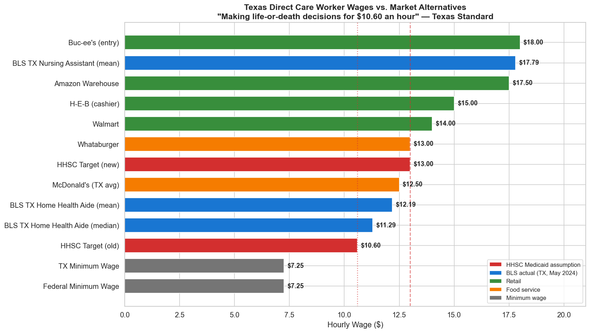
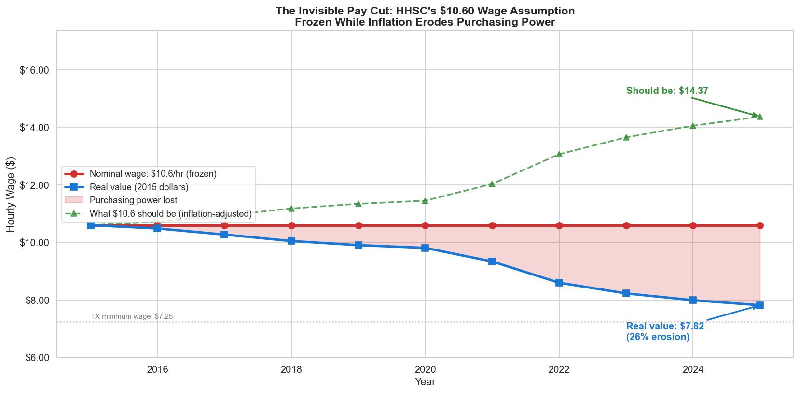
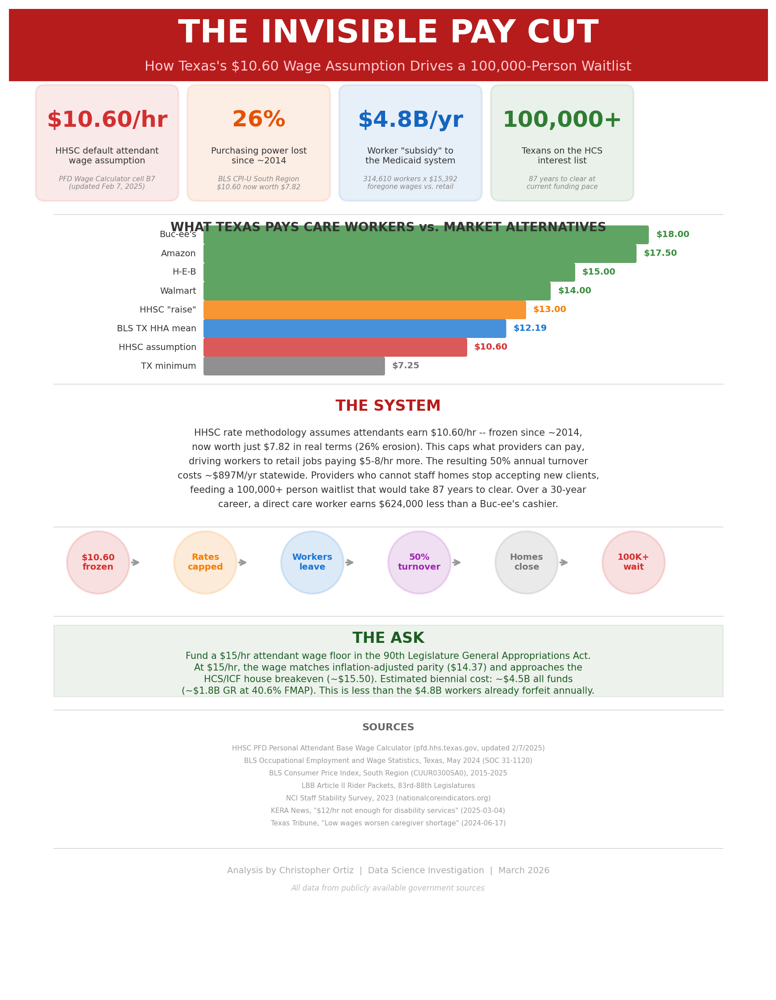

# The Invisible Pay Cut

**How Texas's $10.60 Wage Assumption Drives a 100,000-Person Waitlist**

A data-driven investigation into how HHSC's frozen Medicaid wage assumption creates a cascading crisis: poverty wages for caregivers, 50% annual workforce turnover, and over 100,000 Texans with disabilities waiting years — sometimes decades — for services.

---



*Texas pays its direct care workers less than Buc-ee's, Amazon, H-E-B, Walmart, and Whataburger. The HHSC wage assumption ($10.60/hr) has been frozen since ~2014.*

---



*After a decade of inflation, $10.60/hr is worth just $7.82 in real terms — a 26% pay cut that never showed up on a paystub. To match 2015 purchasing power, the wage would need to be $14.37/hr.*

---

## Key Findings

| Statistic | Value | Source |
|---|---|---|
| HHSC wage assumption | **$10.60/hr** | PFD Wage Calculator cell B7 (2/7/2025) |
| Real purchasing power | **$7.82/hr** | BLS CPI-U South Region, ~2015 baseline |
| Inflation-adjusted parity | **$14.37/hr** | CPI deflation calculation |
| BLS TX Home Health Aide mean | **$12.19/hr** | OEWS May 2024, SOC 31-1120 |
| TX HHA employment | **314,610 workers** | BLS OEWS May 2024 |
| Annual worker "subsidy" | **~$4.8B/yr** | Foregone wages vs. entry-level retail |
| HCS interest list | **100,000+ people** | HHSC Interest List data |
| Years to clear waitlist | **87 years** | At current funding pace (~1,500 slots/yr) |
| DSP annual turnover | **~50%** | NCI Staff Stability Survey 2023 |
| 30-year career earnings gap | **$624,424** | Care worker ($10.60) vs. Buc-ee's ($18.00) |

All math independently verified. Every claim sourced to HHSC, BLS, or LBB data.

## Policy Brief



*One-page summary suitable for legislators, journalists, and advocates. Also available as [PDF](reports/policy_brief.pdf).*

## Reproducing This Analysis

### Prerequisites

- Python >= 3.12
- [uv](https://docs.astral.sh/uv/) (recommended) or pip
- Internet access for BLS API calls (no API key required)

### Setup

```bash
git clone https://github.com/<your-username>/texas-hhcs.git
cd texas-hhcs

# Option A: uv (recommended)
uv venv && source .venv/bin/activate
uv pip install -e ".[dev]"

# Option B: pip
python -m venv .venv && source .venv/bin/activate
pip install -e ".[dev]"
```

### Running the Notebooks

Run notebooks **in order** — later notebooks depend on data and modules established by earlier ones.

```bash
jupyter lab
```

| Notebook | Purpose | External API calls | Outputs |
|---|---|---|---|
| `00_data_collection.ipynb` | Download HHSC rate data, BLS OEWS wage data, build `market_wages.csv` | HHSC (pfd.hhs.texas.gov), BLS OEWS | `data/processed/*.csv` |
| `01_provider_classification.ipynb` | Provider type confirmation (ICF vs HCS) | None (stub) | — |
| `02_house_pnl_model.ipynb` | Per-house revenue vs. cost model | None (stub) | — |
| `03_wage_policy_analysis.ipynb` | Core wage analysis: rate anatomy, margins, wage comparisons | None | 6 charts in `reports/` |
| `04_waitlist_access.ipynb` | HCS waitlist crisis, turnover cost modeling, causal chain | None | 3 charts in `reports/` |
| `05_wage_stagnation.ipynb` | CPI inflation erosion, worker subsidy math, lifetime earnings | BLS CPI API (`api.bls.gov`) | 4 charts in `reports/` |
| `06_policy_brief.ipynb` | Single-page policy brief generation | None | `reports/policy_brief.png`, `.pdf` |

> **Note:** Notebooks 01 and 02 are stubs for future provider-level and P&L analysis. The core investigation runs through 00, 03, 04, 05, and 06.

### API Dependencies

This project uses **public, unauthenticated** government APIs:

| API | Endpoint | Rate Limit | Used In |
|---|---|---|---|
| BLS CPI-U | `api.bls.gov/publicAPI/v2/timeseries/data/` | 10-year window per request, 25 requests/day | `05_wage_stagnation.ipynb` via `src/texas_hhcs/cpi.py` |
| BLS OEWS | `api.bls.gov/publicAPI/v2/timeseries/data/` | Same as above | `00_data_collection.ipynb` |
| HHSC PFD | `pfd.hhs.texas.gov` | None documented | `00_data_collection.ipynb` via `src/texas_hhcs/scraper.py` |

No API keys, accounts, or credentials are required. All data can also be downloaded manually from the source websites.

### Data Pipeline

```
HHSC pfd.hhs.texas.gov ──► scraper.py ──► data/processed/pfd_wage_calculator_*.csv
BLS api.bls.gov         ──► cpi.py    ──► CPI monthly/annual (in-memory)
BLS OEWS flat files     ──► pandas    ──► data/processed/bls_oews_texas_2024.csv
Manual research         ──► notebook  ──► data/processed/market_wages.csv
                                            │
                    ┌───────────────────────┘
                    ▼
            Notebooks 03-06 ──► reports/*.png, reports/policy_brief.pdf
```

### Regenerating All Charts

To regenerate every chart and the policy brief from scratch:

```bash
# Run all analysis notebooks in sequence
jupyter nbconvert --to notebook --execute notebooks/00_data_collection.ipynb
jupyter nbconvert --to notebook --execute notebooks/03_wage_policy_analysis.ipynb
jupyter nbconvert --to notebook --execute notebooks/04_waitlist_access.ipynb
jupyter nbconvert --to notebook --execute notebooks/05_wage_stagnation.ipynb
jupyter nbconvert --to notebook --execute notebooks/06_policy_brief.ipynb
```

All outputs land in `reports/`.

## Project Structure

```
texas-hhcs/
├── notebooks/
│   ├── 00_data_collection.ipynb      — Data download & processing
│   ├── 01_provider_classification.ipynb — Provider type lookup (stub)
│   ├── 02_house_pnl_model.ipynb      — Per-house P&L model (stub)
│   ├── 03_wage_policy_analysis.ipynb  — Core wage analysis (6 charts)
│   ├── 04_waitlist_access.ipynb       — Waitlist + turnover crisis (3 charts)
│   ├── 05_wage_stagnation.ipynb       — CPI erosion + subsidy math (4 charts)
│   └── 06_policy_brief.ipynb         — Policy brief generator
├── src/texas_hhcs/
│   ├── __init__.py
│   ├── cpi.py                        — BLS CPI retrieval + wage deflation
│   ├── rates.py                      — HHSC rate structures (ICF, HCS)
│   ├── budget.py                     — Biennium budget data model
│   ├── staffing.py                   — 24/7 staffing coverage model
│   └── scraper.py                    — HHSC rate data scraper
├── data/
│   ├── raw/                          — Original downloaded data
│   └── processed/                    — Cleaned analysis-ready CSVs
├── reports/                          — All generated charts + policy brief
└── references/
    └── sources.yaml                  — Full source index with URLs
```

## Data Sources

All data comes from publicly available government sources. No FOIA requests, no proprietary data, no paywalled databases.

| Source | What we use | URL |
|---|---|---|
| **HHSC** PFD Wage Calculator | Attendant wage assumptions by program | pfd.hhs.texas.gov |
| **BLS** OEWS | TX Home Health Aide employment & wages (SOC 31-1120) | bls.gov/oes/ |
| **BLS** CPI-U South Region | Inflation data, series CUUR0300SA0 | bls.gov/cpi/ |
| **LBB** Article II Riders | HCS slots funded & wage assumptions, 83rd–89th Legislatures | lbb.texas.gov |
| **NCI** Staff Stability Survey | National DSP turnover rates | nationalcoreindicators.org |
| **HHSC** Interest List data | HCS waitlist size over time | hhs.texas.gov |

See [references/sources.yaml](references/sources.yaml) for the complete source index with direct URLs, access dates, and descriptions.

## Methodology Notes

- **CPI deflation** uses BLS series CUUR0300SA0 (CPI-U, All Items, South Urban), which matches the geographic region where these workers live and spend their wages.
- **Wage erosion** is computed as: `real_value = $10.60 × (base_year_CPI / current_year_CPI)`. The inverse gives the inflation-adjusted wage that $10.60 *should* be.
- **Worker subsidy** uses BLS OEWS employment count (314,610 TX HHAs) × hourly gap × 2,080 annual hours. This is a conservative estimate — it uses the Buc-ee's entry wage ($18/hr) as the comparison, not median retail.
- **Waitlist projection** divides current interest list size by historical average annual slot funding rate (~1,500/yr across 6 biennia).
- **Turnover costs** include direct replacement ($2,500/hire), overtime coverage during vacancies, and quality incident costs. Based on NCI/ANCOR national benchmarks applied to TX workforce size.
- **Lifetime earnings** assume 2% annual raises for all career paths over 30 years, compounded. The gap is not sensitive to the raise assumption — it persists at any reasonable growth rate.

## The Ask

Fund a **$15/hr attendant wage floor** in the 90th Legislature General Appropriations Act, indexed annually to CPI-U South Region. Estimated biennial cost: ~$4.5B all funds (~$1.8B GR at 40.6% FMAP). This is less than the $4.8B workers already forfeit annually in below-market labor.

## License

This work is licensed under [CC BY 4.0](https://creativecommons.org/licenses/by/4.0/) — free to share and adapt, but **you must give credit**. Suggested citation:

> Ortiz, C. (2026). "The Invisible Pay Cut: How Texas's $10.60 Wage Assumption Drives a 100,000-Person Waitlist." Data science investigation.

---

*Analysis by Christopher Ortiz — March 2026*
